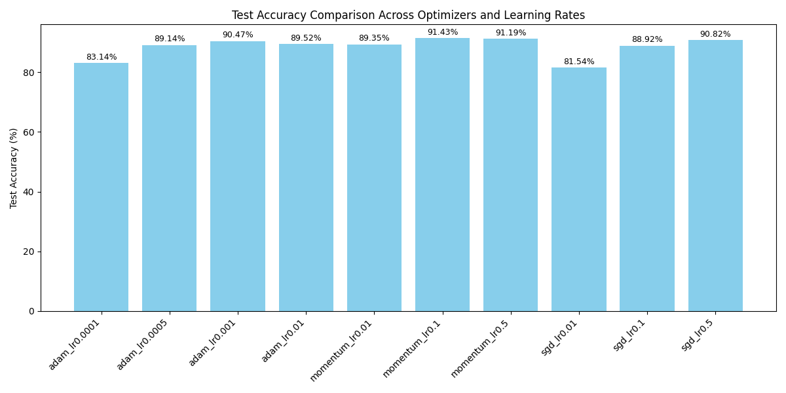

# Implementation of ResNet for CIFAR-10 classification

## Requirements
- Python 3.6+
- PyTorch 1.6.0+

## Usage
1. Train

```
mkdir path/to/checkpoint_dir
python train.py --n 3 --checkpoint_dir path/to/checkpoint_dir
```
`n` means the network depth, you can choose from {3, 5, 7, 9}, which means ResNet-{20, 32, 44, 56}.
For other options, please refer helps: `python train.py -h`.
When you run the code for the first time, the dataset will be downloaded automatically.

2. Test

When your training is done, the model parameter file `path/to/checkpoint_dir/model_final.pth` will be generated.
```
python test.py --n 3 --params_path path/to/checkpoint_dir/model_final.pth
```

## Note
If you want to specify GPU to use, you should set environment variable `CUDA_VISIBLE_DEVICES=0`, for example.

## References
- Kaiming He, Xiangyu Zhang, Shaoqing Ren, Jian Sun, "Deep residual learning for image recognition," In Proceedings of the IEEE conference on computer vision and pattern recognition, 2016.

## Modify
```
conda activate your_env

python train.py --n 3 --n_iter 64000 --optimizer sgd --lr 0.01 --save_params_freq 10000 --checkpoint_dir checkpoint_sgd_0.01 | Tee-Object -FilePath logs/sgd_lr0.01.log
python train.py --n 3 --n_iter 64000 --optimizer sgd --lr 0.1 --save_params_freq 10000 --checkpoint_dir checkpoint_sgd_0.1 | Tee-Object -FilePath logs/sgd_lr0.1.log
python train.py --n 3 --n_iter 64000 --optimizer sgd --lr 0.5 --save_params_freq 10000 --checkpoint_dir checkpoint_sgd_0.5 | Tee-Object -FilePath logs/sgd_lr0.5.log

python train.py --n 3 --n_iter 64000 --optimizer momentum --lr 0.01 --save_params_freq 10000 --checkpoint_dir checkpoint_momentum_0.01 | Tee-Object -FilePath logs/momentum_lr0.01.log
python train.py --n 3 --n_iter 64000 --optimizer momentum --lr 0.1 --save_params_freq 10000 --checkpoint_dir checkpoint_momentum_0.1 | Tee-Object -FilePath logs/momentum_lr0.1.log
python train.py --n 3 --n_iter 64000 --optimizer momentum --lr 0.5 --save_params_freq 10000 --checkpoint_dir checkpoint_momentum_0.5 | Tee-Object -FilePath logs/momentum_lr0.5.log

python train.py --n 3 --n_iter 64000 --optimizer adam --lr 0.01 --save_params_freq 10000 --checkpoint_dir checkpoint_adam_0.01 | Tee-Object -FilePath logs/adam_lr0.01.log
python train.py --n 3 --n_iter 64000 --optimizer adam --lr 0.001 --save_params_freq 10000 --checkpoint_dir checkpoint_adam_0.001 | Tee-Object -FilePath logs/adam_lr0.001.log
python train.py --n 3 --n_iter 64000 --optimizer adam --lr 0.0005 --save_params_freq 10000 --checkpoint_dir checkpoint_adam_0.0005 | Tee-Object -FilePath logs/adam_lr0.0005.log
python train.py --n 3 --n_iter 64000 --optimizer adam --lr 0.0001 --save_params_freq 10000 --checkpoint_dir checkpoint_adam_0.0001 | Tee-Object -FilePath logs/adam_lr0.0001.log
```

## Results

---

# ResNet CIFAR-10 Optimizer and Learning Rate Experiment

---

## **Convergence Analysis**

### 🔹 **Plain SGD**:
- Learning rate **0.5** shows the fastest convergence among all SGD settings.
- After around **32,000 iterations**, the effect of learning rate diminishes — curves of **SGD 0.1** and **SGD 0.5** are very similar beyond this point.
- **Smaller learning rate (0.01)** slows down convergence significantly and results in lower final accuracy.

### 🔹 **Momentum (0.9)**:
- The learning rate has **minimal impact** on convergence speed compared to plain SGD.
- **Momentum with learning rate 0.1** converges fastest, reaching stability around **48,000 iterations**.
- After **48,000 iterations**, the loss curves for **0.01, 0.1, and 0.5** almost overlap, indicating the model has reached its optimal region and learning rate no longer affects performance significantly.
- This shows that **momentum helps the model escape poor local minima quickly and stabilizes training**.

### 🔹 **Adam**:
- The convergence behavior of Adam is **more unpredictable**.
- **Learning rate variations lead to noticeable differences** in both convergence speed and final performance.
- **Adam is sensitive to learning rate**, with very low learning rates causing slow convergence, while slightly higher rates may lead to fast but unstable performance.

---

## **Summary Insight**:
- **Momentum** provides the best stability and is less sensitive to learning rate once training enters the late phase.
- **Plain SGD** heavily relies on careful learning rate tuning for fast convergence.
- **Adam** adapts quickly but needs careful learning rate selection to avoid instability or slow learning.

---

## 🔎 Experiment Summary
This experiment evaluates the impact of different optimizers (SGD, Momentum, Adam) and learning rates on the **test accuracy** of a ResNet model trained on the **CIFAR-10 dataset**.

For each optimizer, we tested multiple learning rates and recorded the final test accuracy. The results are visualized in the bar chart below:



---

## ✅ Key Observations from the Plot:
| Optimizer         | Learning Rate | Test Accuracy (%) |
|-------------------|-------------|-------------------|
| Adam              | 0.0001      | 83.14             |
| Adam              | 0.0005      | 89.14             |
| Adam              | 0.001       | 90.47             |
| Adam              | 0.01        | 89.52             |
| Momentum (0.9)    | 0.01        | 89.35             |
| Momentum (0.9)    | 0.1         | **91.43** (Best)  |
| Momentum (0.9)    | 0.5         | 91.19             |
| SGD               | 0.01        | 81.54             |
| SGD               | 0.1         | 88.92             |
| SGD               | 0.5         | 90.82             |

---

## 📝 Detailed Analysis:
- **Momentum optimizer with learning rate 0.1** achieves the **highest test accuracy of 91.43%**. This confirms that momentum helps improve generalization and convergence speed.
- **Adam optimizer** performs well with learning rates **0.001** and **0.01**, but struggles when the learning rate is too small (0.0001).
- **SGD without momentum** shows the worst performance at a low learning rate (0.01, only 81.54% accuracy), confirming that plain SGD converges slower and struggles without momentum.
- Surprisingly, **SGD with a high learning rate (0.5)** achieves **90.82% accuracy**, but is less stable compared to momentum.

---

## 🔔 Conclusion:
- **Momentum with learning rate 0.1** is the best combination for this ResNet model on CIFAR-10.
- **Adam** is more robust to learning rate choices but slightly underperforms compared to well-tuned momentum.
- **SGD** is sensitive to learning rates and generally needs momentum to perform well.

---

## 📂 Project Structure:
```
├── logs/                        # Raw log files
├── test_accuracy_comparison.png # Final accuracy bar chart
├── plot.py                      # Python script to parse logs and plot
├── README.md                    # This analysis report
```

---

